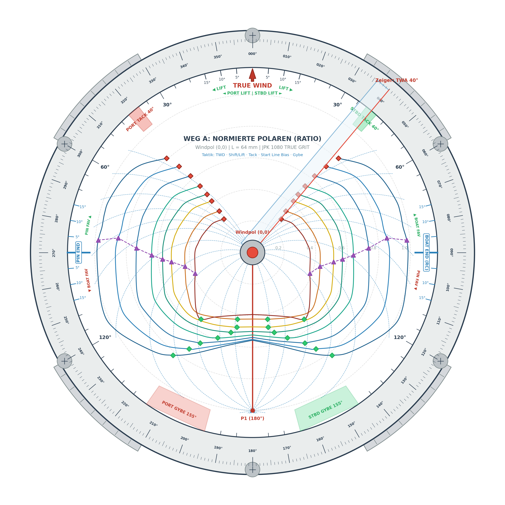
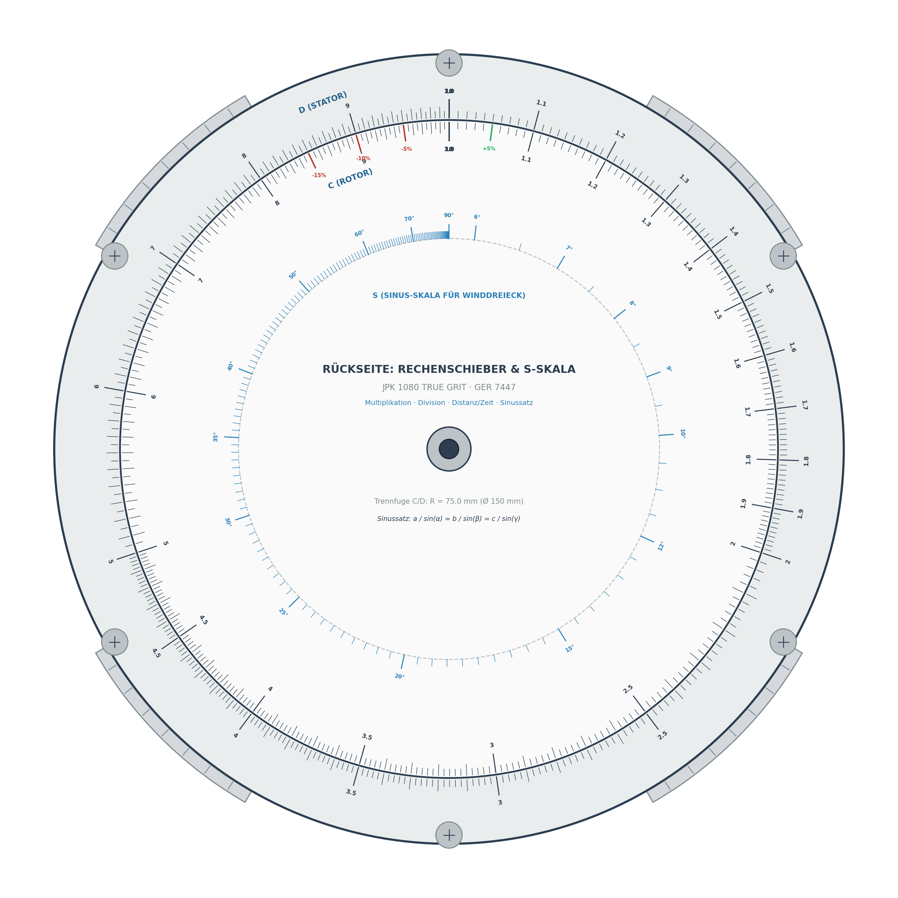

# 🧭 Nautische Rechenscheibe & Taktik-Suite V1.0 – JPK 1080 (*TRUE GRIT*, GER 7447)

Professionelles, analog-digitales Regatta-, Navigations- und Taktiksystem für die Yacht **JPK 1080 (*TRUE GRIT*, GER 7447)**.  
Dieses System verbindet die offiziellen **ORC-VPP-Polardaten** (ORC International / Club, Run-ID `249116`) mit:
1. Einer **doppelseitigen $\varnothing 180\,\text{mm}$ Sandwich-Rechenscheibe** mit integriertem **TackingMaster-Taktikring**, normierten ORC-Polaren (Weg A), echten AWA-Fasskreisbögen und zirkularem Rechenschieber.
2. Einer **vollständigen Fertigungssuite** mit 3D-Druck-Modellen (STL) und hochpräzisen Laser-CAM-Vektordateien (SVG).
3. Einem **digitalen Taktik-Bordcomputer** (`tactical_advisor.py`) mit Einzelsegelanalyse und Isochronen-Routenoptimierer (`route_optimizer.py`).

---

## 📑 Inhaltsverzeichnis
1. [Systemübersicht & Mechanische Architektur (180 mm Sandwich-Kassette)](#-systemübersicht--mechanische-architektur)
2. [Vorderseite (Seite A): Taktikring & Normierte Polaren (Weg A)](#-vorderseite-seite-a-taktikring--normierte-polaren-weg-a)
3. [Rückseite (Seite B): Zirkularer Rechenschieber & Sinus-Skala (S-Skala)](#-rückseite-seite-b-zirkularer-rechenschieber--sinus-skala)
4. [Hardware-Fertigungsanleitung (3D-Druck & Lasergravur)](#-hardware-fertigungsanleitung)
5. [Software-Suite & CLI-Bedienung](#-software-suite--cli-bedienung)
6. [Taktisches Handbuch für den Regatta-Einsatz](#-taktisches-handbuch-für-den-regatta-einsatz)
7. [Dateistruktur des Repositories](#-dateistruktur-des-repositories)

---

## 📐 Systemübersicht & Mechanische Architektur

Die Rechenscheibe basiert auf einem robusten **$\varnothing 180\,\text{mm}$ Sandwich-Kassettensystem**, das für harte Hochsee- und Regattabedingungen im Cockpit entwickelt wurde.

```
                  EXPLOSIONSDARSTELLUNG DER 180 mm KASSETTE
                  
       [ 6x M3 Senkschrauben auf Teilkreis Ø 176 mm ]
                            │
                            ▼
     ┌──────────────────────────────────────────────────────────┐
     │  GEHÄUSE-DECKEL (STATOR VORDERSEITE)                     │  Ø 180 mm
     │  360° Kompassrose graviert · Sichtfenster Ø 150 mm       │  Dicke: 2.2 mm
     └──────────────────────────────────────────────────────────┘
                            │
                            ▼
     ┌──────────────────────────────────────────────────────────┐
     │  MITTELSCHEIBE (DOPPELSEITIGER ROTOR)                    │  Ø 150 mm (Rumpf)
     │  • Seite A: TackingMaster-Taktik & Polaren (Weg A)       │  Ø 172 mm (Führungsfeder)
     │  • Seite B: Log-Skala C & Sinusskala S                   │  Ø 186 mm (4 Daumen-Tabs)
     └──────────────────────────────────────────────────────────┘
                            ▲
                            │  [ Axialspiel: 0.4 mm · Radialspiel: 0.5 mm ]
                            │
     ┌──────────────────────────────────────────────────────────┐
     │  GEHÄUSE-BODEN (STATOR RÜCKSEITE)                        │  Ø 180 mm
     │  Umlaufende Führungsnut (Ø 173 mm x 2.4 mm)              │  Dicke: 4.0 mm
     │  Logarithmische Skala D graviert                         │
     └──────────────────────────────────────────────────────────┘
                            │
                            ▼
     ┌──────────────────────────────────────────────────────────┐
     │  ZENTRALZEIGER & ACHSPIN                                 │  Länge: 85 mm
     │  Acryl-Zeigerarm mit Ratio-Skala · Formschlüssiger Bolzen│  Pin: Ø 3.0 mm
     └──────────────────────────────────────────────────────────┘
```

### Mechanische Spezifikationen
* **Außendurchmesser:** $180.0\,\text{mm}$
* **Sichtfenster / Drehscheiben-Durchmesser:** $150.0\,\text{mm}$
* **Bedienung:** 4 gerändelte Daumen-Tabs an der Drehscheibe (protrudieren auf $\varnothing 186.0\,\text{mm}$, je $15^\circ$ Bogenbreite bei $45^\circ, 135^\circ, 225^\circ, 315^\circ$).
* **Führungssystem:** Feder-Nut-Führung ($\varnothing 172.0\,\text{mm}$ Federring am Rotor greift in $\varnothing 173.0\,\text{mm} \times 2.4\,\text{mm}$ Nut im Boden) – garantiert absolut spielfreien, seidenweichen Lauf ohne Verkanten.
* **Verschraubung:** 6 symmetrische $M3$-Senkkopfschrauben auf Teilkreis $\varnothing 176.0\,\text{mm}$.
* **Zentraler Zeigerarm:** $85\,\text{mm}$ transparenter Acrylzeiger mit radialer roter Peilkante, gravierter Ratio-Skala ($0.0$ bis $1.2$) und Peilspitze zur äußeren Stator-Kompassrose.

---

## ⛵ Vorderseite (Seite A): Taktikring & Normierte Polaren (Weg A)

Die Vorderseite vereint die Funktionalität des bekannten **TackingMaster-Regattarechners** mit den hochpräzisen **ORC-Geschwindigkeitspolaren** der JPK 1080.



### 1. Der äußere Stator-Kompassring ($\varnothing 150$ bis $\varnothing 180\,\text{mm}$)
* Vollständige **$360^\circ$-Kompassrose** mit $1^\circ$-Feinteilung, $5^\circ$-Teilung und $10^\circ$-Beschriftung.
* Bleibt starr am Gehäuse ausgerichtet; dient zur Peilung von Windrichtung ($TWD$), Kurs über Grund ($COG$) und Landmarken.

### 2. Der integrierte TackingMaster-Taktikring (Rotor-Rand $\varnothing 132$ bis $\varnothing 150\,\text{mm}$)
* **TRUE WIND Index (12 Uhr):** Markanter roter Pfeil zum Ausrichten der Drehscheibe auf die aktuelle Wahre Windrichtung ($TWD$).
* **Winddreher-Skalen (Shift / Lift):**  
  $\pm 5^\circ, \pm 10^\circ, \pm 15^\circ$ Skalierung zu beiden Seiten des Windpfeils. Zeigt sofort, ob ein Winddreher ein **LIFT** (Höhe laufen) oder ein **HEADER** (Abfallen) auf dem aktuellen Bug ist.
* **TACK-Wendewinkel-Sektoren:**  
  Farbcodierte Zonen für Am-Wind-Kurse von **$38^\circ$ bis $42^\circ$** (Grün = Steuerbordbug / Starboard Tack, Rot = Backbordbug / Port Tack). Zeigt direkt den neuen Kurs nach der Wende an.
* **START LINE BIAS System ($\pm 90^\circ$ zur Windachse):**  
  * Eingezeichnete Peilmarken bei $+90^\circ$ (**Boat End / Startschiff**) und $-90^\circ$ (**Pin End / Starttonne**).
  * Bias-Skalen mit $\pm 5^\circ, \pm 10^\circ, \pm 15^\circ$ Abweichung: Ermöglicht die sekundenschnelle Bestimmung des bevorteilten Startlinien-Endes.
* **GYBE-Halsenwinkel-Sektoren:**  
  Farbcodierte Zonen für Vorwind-Kurse von **$145^\circ$ bis $165^\circ$** (Target VMG Gybe Angle bei $155^\circ$).

### 3. Normierte ORC-Geschwindigkeitspolaren (Weg A, $L = 64\,\text{mm}$)
* **Windpol im geometrischen Zentrum $(0,0)$:**  
  Der wahre Windvektor entspringt direkt im Drehpunkt der Scheibe.
* **Basislinie:** Rote Vertikallinie vom Windpol $(0,0)$ nach unten zum Gegenpol $P_1(180^\circ)$ bei $(0, -64\,\text{mm})$.
* **8 Windgeschwindigkeiten:** Kurven für $6, 8, 10, 12, 14, 16, 20, 24\,\text{kt}$ True Wind Speed ($TWS$).
* **Physikalische Normierung:** Der Radius entspricht dem Geschwindigkeitsverhältnis $\text{Ratio} = \frac{V_{BS}}{TWS}$.
* **VMG-Targets:**  
  * Rote Rauten: Optimale Am-Wind-Punkte ($VMG_{upwind}$ Beat Angles zwischen $42.3^\circ$ und $40.7^\circ$).
  * Grüne Rauten: Optimale Vorwind-Punkte ($VMG_{downwind}$ Run Angles zwischen $142^\circ$ und $165^\circ$).
* **Segel-Crossover (Jib vs. Asymmetrischer Gennaker):**  
  Violette Dreiecke und gestrichelte Grenzlinie markieren exakt den wahren Windwinkel ($TWA$), bei dem das Setzen des Gennakers schneller ist als die Genua/Fock.
* **Echte AWA-Fasskreisbögen:**  
  Kreisbögen durch Windpol $(0,0)$ und $P_1(180^\circ)$ für $AWA = 25^\circ, 30^\circ, 35^\circ, 40^\circ, 45^\circ, 50^\circ, 60^\circ, 75^\circ, 90^\circ, 110^\circ, 135^\circ, 155^\circ$. Ermöglichen die sofortige Ablesung des scheinbaren Windes ohne Vektorkonstruktion.

---

## 🔢 Rückseite (Seite B): Zirkularer Rechenschieber & Sinus-Skala

Die Rückseite verwandelt die Rechenscheibe in einen hochpräzisen Navigationsrechner zur Lösung von Multiplikation, Division, Weg-Zeit-Geschwindigkeit und Winddreiecks-Trigonometrie.



### 1. Die Skalenanordnung
* **D-Skala (Stator / Fester Außenring):**  
  Logarithmische Grundskala von $1.0$ bis $10.0$ entlang des Radius $75.5\,\text{mm}$ bis $82.0\,\text{mm}$.
* **C-Skala (Rotor / Drehscheibe):**  
  Identische logarithmische Skala von $1.0$ bis $10.0$ entlang des Radius $74.5\,\text{mm}$ nach innen.
* **Haarfeine Trennfuge bei $R = 75.0\,\text{mm}$:**  
  C- und D-Skala gleiten unmittelbar aneinander vorbei, was parallaxenfreies Ablesen ermöglicht.
* **S-Skala (Sinusskala bei $R = 48.0\,\text{mm}$):**  
  Logarithmische Teilung für Winkel von $6^\circ$ bis $90^\circ$ gemäss $\theta = 360^\circ \cdot \log_{10}(10 \cdot \sin\alpha)$.
* **Performance-Nonius (bei der $1.0$-Marke):**  
  Farbige Marken für $-15\%, -10\%, -5\%$ (Rot) und $+5\%$ (Grün) erlauben den schnellen Soll/Ist-Vergleich der Bootsgeschwindigkeit.

### 2. Rechenbeispiele

#### A. Bootsgeschwindigkeit aus Ratio berechnen ($\text{Ratio} \times TWS = V_{BS}$)
1. Lies auf Seite A an der Zeigerkante die Ratio ab (z. B. **$0.54$** bei $16\,\text{kt}$ Wind auf $TWA = 110^\circ$).
2. Drehe die Scheibe um: Stelle die **$1.0$** der C-Skala (Rotor) auf die **$0.54$** (bzw. $5.4$) der D-Skala (Stator).
3. Suche auf der C-Skala den Windwert **$1.6$** ($16\,\text{kt}$).
4. Lies auf der D-Skala direkt das Ergebnis ab: **$8.64\,\text{kt}$** Targets-Speed!

#### B. Distanz- und Fahrzeitberechnung ($\text{Distanz} = \text{Speed} \times \text{Zeit}$)
* Stelle die $1.0$ auf die Bootsgeschwindigkeit in Knoten.
* Lies für jede Fahrzeit in Stunden (C-Skala) direkt die Seemeilen (D-Skala) ab.

#### C. Lösung des Winddreiecks über die S-Skala (Sinussatz)
Im Winddreieck gilt:
$$\frac{V_{BS}}{\sin(\delta)} = \frac{AWS}{\sin(TWA)} = \frac{TWS}{\sin(AWA)}$$
Durch Kopplung der Sinusskala mit den logarithmischen Skalen lassen sich scheinbarer Windwinkel ($AWA$) und wahrer Windwinkel ($TWA$) rein mechanisch ineinander umrechnen.

---

## 🛠️ Hardware-Fertigungsanleitung

Alle Fertigungsdateien wurden mit sub-millimetergenauen Toleranzen erzeugt.

### 1. 3D-Druck (Dateien in `output/stl/`)

| Dateiname | Bauteil | Abmessungen | Empfohlenes Material |
| :--- | :--- | :--- | :--- |
| [`gehaeuse_deckel_180mm.stl`](output/stl/gehaeuse_deckel_180mm.stl) | Gehäuse-Deckel (Stator A) | $\varnothing 180 \times 2.2\,\text{mm}$, Fenster $\varnothing 150\,\text{mm}$ | PETG / ASA / PLA-CF |
| [`gehaeuse_boden_180mm.stl`](output/stl/gehaeuse_boden_180mm.stl) | Gehäuse-Boden (Stator B) | $\varnothing 180 \times 4.0\,\text{mm}$, Nut $\varnothing 173 \times 2.4\,\text{mm}$ | PETG / ASA / PLA-CF |
| [`mittelscheibe_rotor_180mm.stl`](output/stl/mittelscheibe_rotor_180mm.stl) | Rotor-Drehscheibe | $\varnothing 150/\varnothing 172/\varnothing 186 \times 2.0\,\text{mm}$ | PETG / Weiß matt |
| [`zentralzeiger_lineal.stl`](output/stl/zentralzeiger_lineal.stl) | Peilzeiger | Länge $85\,\text{mm}$, Breite $7\,\text{mm}$, Dicke $1.5\,\text{mm}$ | Transparentes PETG / Resin |
| [`achspin_mittelbolzen.stl`](output/stl/achspin_mittelbolzen.stl) | Zentraler Achsbolzen | Schaft $\varnothing 3.0 \times 7.2\,\text{mm}$, Kopf $\varnothing 9.0\,\text{mm}$ | PETG / Nylon / Messing |

#### Druckparameter-Empfehlung
* **Schichthöhe:** $0.12\,\text{mm}$ bis $0.16\,\text{mm}$
* **Wandlinien (Perimeters):** Mindestens 4 Linien
* **Infill:** $100\%$ für verzugsfreie Planlage
* **Oberflächen-Glätten (Ironing):** Auf allen Deckschichten aktivieren, um eine spiegelglatte Basis für die Skalengravur zu erhalten.

### 2. Laserschneiden & Vektorgravur (Dateien in `output/svg/`)

Die SVG-Dateien sind 1:1 im Millimeter-Maßstab für moderne CAM- und Lasersoftware (LightBurn, RDWorks, Glowforge, Trotec JobControl) vorbereitet:

| Dateiname | Funktion | Farben & Ebenen |
| :--- | :--- | :--- |
| [`laser_seite_a_rotor_vorderseite.svg`](output/svg/laser_seite_a_rotor_vorderseite.svg) | Front Rotor (Polaren & Taktik) | Rot = Schnitt, Schwarz/Farbig = Gravur |
| [`laser_seite_a_deckel_kompassrose.svg`](output/svg/laser_seite_a_deckel_kompassrose.svg) | Stator Deckel ($360^\circ$ Rose) | Rot = Schnitt (Ring & 6x M3), Schwarz = Gravur |
| [`laser_seite_b_rotor_rueckseite.svg`](output/svg/laser_seite_b_rotor_rueckseite.svg) | Back Rotor (C- & S-Skala) | Rot = Schnitt, Schwarz = Gravur |
| [`laser_seite_b_boden_d_skala.svg`](output/svg/laser_seite_b_boden_d_skala.svg) | Stator Boden (D-Skala) | Rot = Schnitt (Ring & 6x M3), Schwarz = Gravur |
| [`laser_zentralzeiger.svg`](output/svg/laser_zentralzeiger.svg) | Acryl-Zeigerarm mit Skala | Rot = Konturschnitt, Schwarz = Ratio-Teilung |

#### Laser-Farbstandard
* **Rot (`#FF0000`, Strichstärke $0.15\,\text{mm}$):** Vektorschnitt (Cut Lines).
* **Schwarz (`#000000`, Strichstärke $0.25\,\text{mm}$):** Feine Vektorgravur (Skalenstriche & Beschriftungen).
* **Buntfarben:** Akzent-Gravuren (Grün `#27AE60`, Rot `#C0392B`, Blau `#2980B9`, Violett `#8E44AD`).

---

## 💻 Software-Suite & CLI-Bedienung

### 1. Alles auf Knopfdruck generieren
```bash
python3 rechenscheibe.py --all
```
Erzeugt alle 5 STL-Dateien, alle 5 SVG-Laserdateien und alle hochauflösenden 300-DPI-PNG-Vorschauen in einem einzigen Durchlauf.

### 2. Gezielte Einzelausführung
```bash
# Nur 3D-Druck-Modelle erzeugen
python3 rechenscheibe.py --stl

# Nur Laser-SVG-Dateien erzeugen
python3 rechenscheibe.py --svg

# Vorschau mit benutzerdefiniertem Zeigerwinkel rendern (z. B. TWA 65°)
python3 rechenscheibe.py --preview --twa 65.0 --dpi 300
```

### 3. Taktischer Regattacomputer (`tactical_advisor.py`)
```bash
python3 tactical_advisor.py --hdg 215 --twd 340 --tws 14
```
Berechnet Soll-Bootsgeschwindigkeit, Krängungswinkel und Segelvergleich (Jib vs. Gennaker) für die eingegebenen Umweltbedingungen.

### 4. Regattakurs-Optimierer (`route_optimizer.py`)
```bash
python3 route_optimizer.py --gpx data/Kursdaten.gpx --twd 340 --tws 14
```

---

## 🏁 Taktisches Handbuch für den Regatta-Einsatz

### Phase 1: Vor dem Start (Startlinien-Bias)
1. Fahre die Startlinie entlang oder peile die Linie mit dem Handpeilkompass (z. B. Kurs $075^\circ$ von Pin zu Schiff).
2. Drehe den Rotor so, dass der rote **TRUE WIND Pfeil** auf die vor dem Start gemessene mittlere Windrichtung ($TWD$, z. B. $345^\circ$) auf der Gehäuse-Kompassrose zeigt.
3. Blicke auf die Markierungen **BOAT END** ($+90^\circ$) und **PIN END** ($-90^\circ$):
   * Liegt die gepeilte Startlinie im Bereich **▲ BOAT FAV**, ist das Startschiff bevorteilt $\rightarrow$ Start am Schiff bringt einen Luv-Vorsprung.
   * Liegt sie im Bereich **PIN FAV ▲**, ist die Starttonne bevorteilt $\rightarrow$ Start an der Tonne bringt sofortigen Raumgewinn.
   * Die Skala ($5^\circ, 10^\circ, 15^\circ$) quantifiziert den Längen-Vorteil direkt in Metern pro 100 m Linienlänge!

### Phase 2: Am-Wind-Schlag (Upwind Beat & Shifts)
1. Richte die Scheibe auf den gemittelten Grundwind aus.
2. Der optimale Am-Wind-Winkel liegt in den grünen/roten **TACK Sectors ($38^\circ$ bis $42^\circ$)**.
3. **Winddreher ausnutzen:**
   * Dreht der Wind nach rechts $\rightarrow$ Auf Steuerbordbug zeigt die Skala **STBD LIFT** $\rightarrow$ Du kannst höher anluven!
   * Dreht der Wind nach links $\rightarrow$ Auf Steuerbordbug zeigt die Skala **HEADER** $\rightarrow$ Wendesignal! Nach der Wende auf Backbordbug bist du im **PORT LIFT**.
4. **Target Speed kontrollieren:**  
   Lege den Zeiger auf $40^\circ$. Lies an der roten Raute der aktuellen Windstärke deine Soll-Geschwindigkeit ab. Erreichst du sie nicht, trimme die Segel oder kontrolliere den Rudergänger!

### Phase 3: Segelwechsel am Crossover
* Am Wind und auf leichtem Raumkurs führt der Zeiger über die Polaren.
* Sobald der Zeiger die **violette Crossover-Linie** überschreitet, überholt das asymmetrische Spi-Polare die Genua-Kurve:
  * Unterhalb der Crossover-Linie: Fock/Genua fahren.
  * Oberhalb der Crossover-Linie: Gennaker setzen!

### Phase 4: Vorwind-Schenkel (Downwind VMG)
* Auf dem Spikurs liegt das optimale Ziel nicht auf direktem Vorwindkurs ($180^\circ$), sondern in den **GYBE Sectors ($145^\circ$ bis $165^\circ$)**, markiert durch die grünen VMG-Rauten.
* Steuere exakt diesen Target-Winkel, um das maximale $VMG_{downwind}$ zu erzielen.

---

## 📁 Dateistruktur des Repositories

```
Rechenscheibe/
├── rechenscheibe.py             # Master CLI Orchestrator (V1.0 Software Suite)
├── vector_engine.py             # CAM / Laser SVG Vektorgrafik-Generator (1:1 CAD)
├── stl_generator.py             # 3D-Druck STL Mesh Generator (Wasserdichte Volumenkörper)
├── preview_engine.py            # 300 DPI High-Resolution Visual Rendering Engine
├── polar_parser.py              # ORC SLK/CSV Parser & Catmull-Rom Spline Interpolator
├── tactical_advisor.py          # Taktischer Digital-Bordcomputer für die JPK 1080
├── route_optimizer.py           # Regattakurs- und Isochronen-Routenplaner
├── orc_extractor.py             # PDF/Text Extrahierung für ORC Speed Guides
├── config_manager.py            # Geometrie- & Toleranzmanager
├── config.json                  # Zentrale Parameter- & Toleranzdatei
│
├── data/
│   ├── 249116.slk               # Offizielle ORC VPP Polardaten JPK 1080 (TRUE GRIT)
│   └── Kursdaten.gpx            # Beispiel-Regattakurs (Rund Fyn / Ostsee)
│
├── output/
│   ├── stl/                     # Druckfertige 3D-Modelle
│   │   ├── gehaeuse_deckel_180mm.stl
│   │   ├── gehaeuse_boden_180mm.stl
│   │   ├── mittelscheibe_rotor_180mm.stl
│   │   ├── zentralzeiger_lineal.stl
│   │   └── achspin_mittelbolzen.stl
│   ├── svg/                     # Fertigungsgerechte Laser-Zuschnitt- & Gravurdateien
│   │   ├── laser_seite_a_rotor_vorderseite.svg
│   │   ├── laser_seite_a_deckel_kompassrose.svg
│   │   ├── laser_seite_b_rotor_rueckseite.svg
│   │   ├── laser_seite_b_boden_d_skala.svg
│   │   └── laser_zentralzeiger.svg
│   └── previews/                # 300 DPI hochauflösende Visualisierungen
│       ├── gesamtansicht_seite_a_montiert.png
│       ├── gesamtansicht_seite_b_montiert.png
│       └── rotor_vorderseite_weg_a.png
│
└── _archive/                    # Revisionssicheres Archiv aller Zwischenstände (Regel 3)
```

---

## 🏆 Projektdaten & Impressum
* **Yacht:** JPK 1080 *TRUE GRIT* (GER 7447)
* **ORC Zertifikat:** 2025 / 2026 (VPP Run 249116)
* **Version:** 1.0 (Freigabe erteilt)
* **Lizenz:** Open Source für die Hochsee-Regatta-Community
